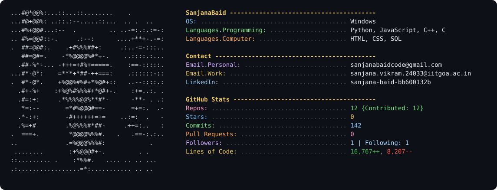

<!--
  This card is regenerated automatically by .github/workflows/update-readme.yml
  (runs generate_readme.py daily + on every push), so repos, stars, commits,
  pull requests, lines of code, followers and following always reflect live
  GitHub data. Edit ascii_art.txt or generate_readme.py to change the look,
  not this file.
-->
